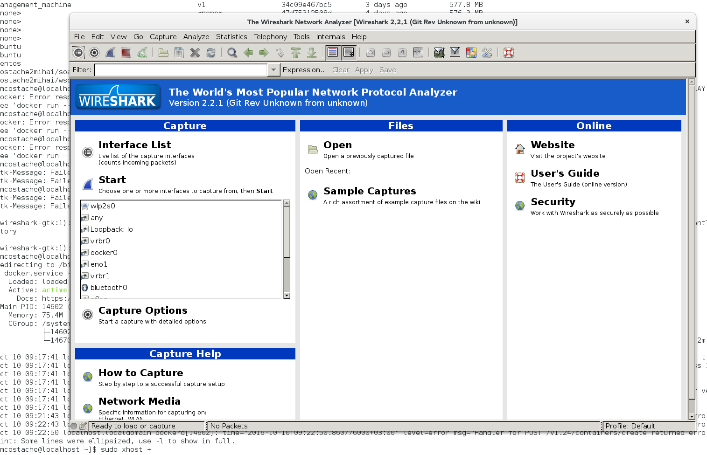

# **How to Dockerize Wireshark**

Since last weekend was a rainy and boring one, in my part of the world, I decided to upgrade my laptop running Fedora 23 to Fedora 24. After encountering a few problems with the straight upgrade, I ended up reinstalling Fedora 24 from scratch. To save my old data I mounted /home directory to the old /home directory (without re-formatting the old partition) when prompted during installation. Long story short, after upgrading I discovered that Wireshark needed to be built from sources for this version of Fedora. So, I decided to take advantage of the powerful tool called Docker.

My idea was to build a Docker container that would run Wireshark inside, would be able to capture data on the host network interface and would forward GUI to my host machine. I was glad I remembered how X11 works and learned how can you actually use a GUI app inside a Docker container.

Here are some useful links I used to document this implementation:

>http://www.linuxquestions.org/questions/linux-server-73/can't-open-display-no-protocol-specified-using-gdm-4175462031/

>https://forums.docker.com/t/how-to-run-gui-app-inside-the-containers/2895/3

>http://www.linuxquestions.org/questions/linux-server-73/can't-open-display-no-protocol-specified-using-gdm-4175462031/

>http://www.yolinux.com/TUTORIALS/GDM_XDMCP.html

>http://dustwell.com/how-x-over-ssh-really-works.html

>https://blog.docker.com/2013/07/docker-desktop-your-desktop-over-ssh-running-inside-of-a-docker-container/


Let’s have a look at the **Dockerfile** used to build the wanted wireshark image:

```
From ubuntu:16.04
MAINTAINER Mihai <costache.mircea.mihai@gmail.com>
# Installing required additional software
RUN apt-get update -y
RUN apt-get install wget bzip2 -y # needed for wireshark download
RUN apt-get install gcc python -y
RUN apt-get install perl pkg-config libglib2.0-dev libpcap-dev gtk2.0 -y
#Download and build latest wireshark
RUN wget https://1.eu.dl.wireshark.org/src/wireshark-2.2.1.tar.bz2
RUN tar -jxf wireshark-2.2.1.tar.bz2
RUN /wireshark-2.2.1/configure && make && make install
RUN ldconfig
ENTRYPOINT ["wireshark-gtk"]
```
Let’s break down the Dockerfile to see what’s going on.


I decided to install Wireshark on Ubuntu 16.04 (inside the container):

>From ubuntu:16.04

After that I needed to update Ubuntu container and install some prerequisites to be able to install wireshark:

>RUN apt-get install wget bzip2 -y # needed for wireshark download

>RUN apt-get install gcc python -y

>RUN apt-get install perl pkg-config libglib2.0-dev libpcap-dev gtk2.0 -y

Next step was to grab the wireshark sources archive; unzip it and execute the well known ./configure && make && make install procedure to build it from sources. Note that you need to provide the absolute path :

>RUN wget https://1.eu.dl.wireshark.org/src/wireshark-2.2.1.tar.bz2

>RUN tar -jxf wireshark-2.2.1.tar.bz2

>RUN /wireshark-2.2.1/configure && make && make install

>RUN ldconfig


The final step was to designate an entry point (a default action that will be execute when this image will be instantiated):

>ENTRYPOINT ["wireshark-gtk"]

** How to use it**

To use this container you will need to have Docker up and running on your host machine:

```
$ service docker status

Redirecting to /bin/systemctl status  docker.service
● docker.service - Docker Application Container Engine
   Loaded: loaded (/usr/lib/systemd/system/docker.service; disabled; vendor preset: disabled)
   Active: active (running) since Mon 2016-10-10 09:17:41 EEST; 42min ago
 	Docs: https://docs.docker.com
```

You then need to run below command to allow all X clients to connect to your X11 server:

```
$ sudo xhost +
access control disabled, clients can connect from any host
```

Go ahead and download the image with:
```
$ docker pull costache2mihai/dockerizedwiresharkformsources
```
Now you can run it (start a container based on that image) with:

```
$ docker run -ti --net=host --privileged -v /home/mcostache/Ezuce:/root -w /root -e DISPLAY=$DISPLAY costache2mihai/dockerizedwiresharkformsources
```

Note that I’ve mounted a volume (folder /home/mcostache/Ezuce ) where I have stored some pcap’s.

If all goes well, on your screen you will see a window like:



Running container with *“--net=host --privileged“* options allows us to capture traffic from host machine interfaces, and since we mounted a folder with pcap’s we can open those capture to analyze traffic.


If you decide to use this container and improve it, don’t forget to share back to the community. We at eZuce love open-source!


Blog article here:
http://sipxcom.org/how-to-dockerize-wireshark/


READ these useful links:

http://www.linuxquestions.org/questions/linux-server-73/can't-open-display-no-protocol-specified-using-gdm-4175462031/
https://forums.docker.com/t/how-to-run-gui-app-inside-the-containers/2895/3
http://www.linuxquestions.org/questions/linux-server-73/can't-open-display-no-protocol-specified-using-gdm-4175462031/
http://www.yolinux.com/TUTORIALS/GDM_XDMCP.html
http://dustwell.com/how-x-over-ssh-really-works.html
https://blog.docker.com/2013/07/docker-desktop-your-desktop-over-ssh-running-inside-of-a-docker-container/


To use it :

docker build -t {your tagname for image} .

then on the host you need to :

$ sudo  xhost +               # at least on my fedora 24
$ XSOXK=/tmp/.X11-unix/X0

$ docker run -ti --net=host --privileged -v {Your pcap folders if you want to- noit necessary}:/root -w /root -v $XSOXK:$XSOXK   -e DISPLAY=$DISPLAY wire2.2.1

Ex:docker run -ti --net=host --privileged -v /home/mihai/DOCUMENTELE_MELE/ezuce/6249:/root -w /root -v $XSOXK:$XSOXK   -e DISPLAY=$DISPLAY -e XAUTHORITY=$XAUTHORITY wire2.2.1
